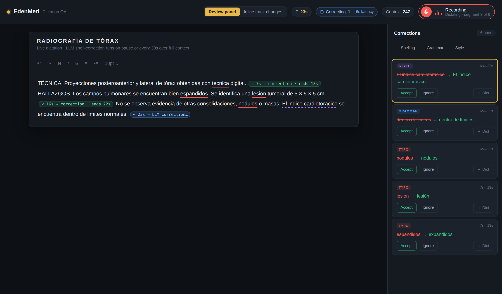

# Dictation Editor — LLM Correction Prototype

A self-contained prototype of a Spanish radiology **dictation editor** with a live
**LLM spell/grammar correction layer**, built for a product demo. It simulates the full
loop: continuous dictation → trigger detection → correction with realistic latency →
in-editor review.

> This is a **front-end prototype**. The corrector is scripted mock data, not a live
> model call — the point is to demonstrate the *interaction model and UX*, not the ASR
> or the LLM. See [Wiring a real model](#wiring-a-real-model) to make it live.



---

## Quick start

No build step, no dependencies to install. Any of these work:

**Option A — just open it**

Open `index.html` in a browser. That file is fully self-contained (CSS + JS inlined),
so it runs from a `file://` path with nothing else.

**Option B — local server (recommended for the modular version)**

```bash
# Python 3
python3 -m http.server 8000
# then visit http://localhost:8000/editor.html
```

```bash
# or Node
npx serve .
```

`editor.html` is the same app but loads `src/styles.css` and `src/app.js` as external
files, so it's easier to read and edit. Because browsers block external files over
`file://`, use a local server for this one.

**Option C — GitHub Pages**

Push to GitHub, enable Pages on the `main` branch, and the demo is live at
`https://<you>.github.io/<repo>/` (Pages serves `index.html` automatically).

---

## What the demo does

Press the **mic** in the top bar. Then watch:

1. A **session clock** starts (`T = Ns`, top bar). It drives everything.
2. Text streams in **word by word**, simulating live dictation.
3. Each spoken sentence ends in a **trigger** — the radiologist says *"punto"* (full
   stop), says *"punto y aparte"* (new line), or goes **silent** for a beat.
4. On a trigger, the corrector fires. A pending chip drops **inline** in the report:
   `⋯ 15s → LLM correction…`
5. Correction runs over the **full context so far** and lands after a fixed **~6 s
   latency**. Dictation keeps streaming during the wait, so later sentences appear while
   an earlier correction is still in flight — exactly like the real system. The chip
   flips to `✓ 15s → correction · ends 21s`.
6. Corrections render as **colored underlines** (see the correction model below). Click,
   right-click, or use the review panel to **Accept / Ignore / Add to dictionary**.

### Two display modes (top-bar toggle)

- **Review panel** — corrections listed on the right; old text underlined in place.
  This is the *working view*.
- **Inline track-changes** — corrections shown in the body as struck-through old text
  followed by the proposed replacement; the right panel is disabled. This is the
  *pre-sign audit view* ("show me everything that changed").

The toggle is pure CSS over the same underlying markup — flipping it never re-runs the
corrector, so you can switch mid-demo on a live set of suggestions.

---

## The correction-layer model

This prototype encodes a specific design for how corrections should surface, worked out
for the radiology use case. The rules that matter:

**Silent tier (no marker).** Punctuation, capitalization, spacing, filler-word removal,
and voice commands are *format, not content*. They're applied silently — marking them
would be noise and would train users to ignore markers.

**Marked tier (word substitutions).** Anything that swaps a word — typos, agreement
fixes — gets a marker. The predicate is computed off the ASR-vs-corrected **diff**, so
it's deterministic and needs no model judgment about severity.

**Three visual weights, by risk:**

| Type | Color | Example |
|------|-------|---------|
| Spelling | red (solid underline) | `espandidos → expandidos` |
| Grammar / agreement | blue (solid underline) | `no muestra → no muestran` |
| Style / accents | purple (dotted underline) | `morfologia → morfología` |

**Meaning-bearing swaps are the dangerous class.** A real-word-for-real-word
substitution where *both* the ASR token and the correction are valid Spanish words
(`plural → pleural`, a number, a laterality term) can change clinical meaning. A quiet
marker is most dangerous exactly there, which is the argument for keeping a distinct
visual weight rather than collapsing everything to one marker.

**Laterality is its own lane — not a correction.** Left/right (`izquierdo/derecho`) is
one of the highest-liability error classes in radiology. The corrector must **never
autonomously swap** one side for the other — doing so would invent a clinical fact it
cannot verify. Laterality tokens belong on a **denylist for substitution**: the system
may *flag* an inconsistency (body says `derecho`, impression says `izquierdo`) but never
silently change a side. This is closer to a critical-values surface than to spellcheck.
*(Not yet implemented in this prototype — documented here as the intended behavior.)*

**Provenance & revert (intended production behavior):**
- Markers **persist until the report is signed**; the raw ASR token is retained per-span
  for the life of the draft.
- **Revert restores the raw ASR token**, anchored to the span — not an undo to a point
  in edit history (surrounding text may have been hand-edited by signing time).
- If the radiologist **manually retypes** the word, the **marker clears** (nothing left
  to review) but the **provenance is still written** to the audit record. The audit entry
  records final state = *human-authored* and stops attributing that text to the correction
  layer.

---

## Tuning the simulation

All knobs live at the top of `src/app.js` (or the inlined `<script>` in `index.html`):

```js
const LATENCY  = 6;    // seconds between a trigger firing and the correction landing
const CLOCK_MS = 240;  // wall-clock ms per simulated second — lower = faster demo
```

The dictated content, per-sentence timing, triggers, and the corrections themselves are
all data in the `SEGMENTS` array:

```js
const SEGMENTS = [
  {
    text: "…TÉCNICA … obtenidas con tecnica digital",
    secs: 7,              // how long this utterance takes to dictate
    trigger: "punto",     // "punto" | "newline" | "silence"
    fixes: [
      { type: "typo", find: "tecnica digital", old: "tecnica",
        nw: "técnica", msg: "Missing accent — “técnica”." }
    ]
  },
  // …
];
```

Swapping in a different report, changing what counts as a trigger, or adding correction
types is a **data edit**, not a code change.

---

## Wiring a real model

To replace the mock corrector with a live call, change one function in `src/app.js`:
`applyFixes(seg, …)` currently reads `seg.fixes` from the mock data. Instead, on each
trigger send the accumulated context to your correction endpoint and map the returned
diff into the same `{type, old, nw, msg}` shape. Everything downstream — markers,
underlines, popover, review panel, accept/ignore, the two display modes — is already
driven off that shape, so nothing else needs to change.

For production you'd also want to anchor spans as
[TinyMCE annotations](https://www.tiny.cloud/docs/tinymce/6/content-annotations/) rather
than raw `<span>`s, so cursor edits can't split a correction, and so the raw-ASR
provenance can ride along on the annotation.

---

## Project layout

```
.
├── index.html        # self-contained demo (open directly, or GitHub Pages entry)
├── editor.html       # same app, loads external src/ files (easier to read/edit)
├── src/
│   ├── styles.css    # all styling
│   └── app.js        # dictation engine + correction UI + mock data
├── docs/
│   └── screenshot.png
├── README.md
└── LICENSE
```

`index.html` and `editor.html` are kept in sync intentionally: the inlined one is for
frictionless viewing and demos; the split one is for working on the code.

---

## Stack

- [TinyMCE 6](https://www.tiny.cloud/) (loaded from CDN) as the rich-text surface
- Vanilla JS, no framework, no build

## License

MIT — see [LICENSE](LICENSE).
